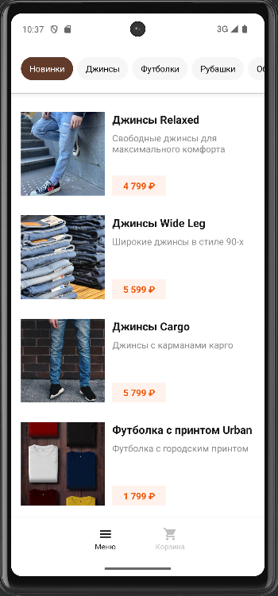
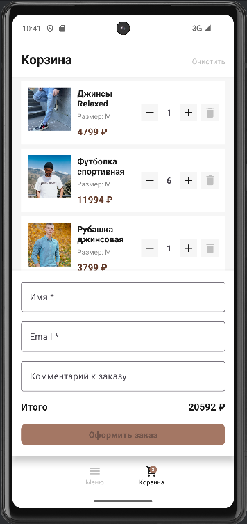

# team-kba — Mobile Store

## О проекте
Мобильное приложение интернет-магазина одежды на Android. Реализованы каталог, детали товара, корзина с оформлением заказа, оффлайн-режим с кэшированием в Room, а также полноценная настройка качества кода (линтер, unit-тесты).

## Скриншоты

| Каталог | Детали товара | Корзина |
|---------|---------------|---------|
|  |  |  |


## Стек технологий

| Компонент | Технология |
|-----------|------------|
| **Платформа** | Android |
| **Язык** | Kotlin |
| **UI** | XML layouts, Material Design 3, Bottom Sheet |
| **Загрузка изображений** | Glide |
| **Асинхронность** | Coroutines + Flow |
| **Архитектура** | MVVM + Repository |
| **Сеть** | Retrofit + OkHttp |
| **Кэширование** | Room Database |
| **Навигация** | Custom Bottom Navigation |
| **Линтер** | ktlint |
| **Тесты** | JUnit + MockK |

## Состав команды и роли

| Имя | Роль |
|------|------|
| Зайнулин Валентин | Разработчик |
| Козлова Кристина | Разработчик |
| Шехоркин Вадим | Тестировщик |


## Реализованный функционал

### Данные и архитектура
- [x] Загрузка товаров из API (`GET /catalog`) через Repository
- [x] Авторизация через Bearer token
- [x] Кэширование товаров в Room Database
- [x] Cache-first стратегия (сначала кэш, потом API)

### Каталог
- [x] Переключение табов фильтрует товары по категории
- [x] Карточка товара отображает изображение, название, цену
- [x] Индикатор загрузки и состояние ошибки с кнопкой повтора
- [x] Счётчик товара на карточке (при добавлении в корзину)

### Детали товара (Bottom Sheet)
- [x] Открывается по тапу на карточку
- [x] Отображает изображение, название, описание, цену, теги, размеры
- [x] Кнопка «В корзину» добавляет товар с выбранным размером
- [x] Кнопка (i) открывает диалог с характеристиками

### Корзина
- [x] Бейдж на иконке корзины отображает количество товаров
- [x] Бейдж обновляется при изменении корзины
- [x] Корзина хранится в Room БД (только `productId`, `sizeId`, `quantity`)
- [x] Отображение собирается из данных каталога и локальной корзины
- [x] Экран корзины содержит:
  - Список товаров с названием, размером, ценой с учётом количества
  - Контрол изменения количества (+/–)
  - Кнопку удаления позиции
  - Общую стоимость
  - Кнопку очистки корзины с модальным подтверждением
  - Empty state (корзина пуста)
- [x] Повторное добавление того же товара и размера увеличивает количество

### Оформление заказа
- [x] Поля для ввода имени, email и комментария
- [x] Валидация имени (непустая строка)
- [x] Валидация email (простая проверка структуры)
- [x] Кнопка «Оформить» отключена, пока форма невалидна
- [x] После успешного оформления: очистка корзины + Alert с подтверждением

### Lifecycle
- [x] Поворот экрана не крашит приложение и не сбрасывает состояние
- [x] Убийство процесса → восстановление состояния (SavedStateHandle + ViewModel)

### Качество кода (Блок 6)
- [x] Настроен `ktlint` для проверки стиля кода
- [x] Написано 5+ unit-тестов (корзина, фильтры)
- [x] Все тесты успешно проходят
- [x] Документация оформлена (README, архитектурная схема, скриншоты)

## Инструкция по сборке

### 1. Клонирование репозитория
```bash
git clone https://github.com/FEIP-FEFU-Mobile-Spring-2026/team-kba.git
cd team-kba